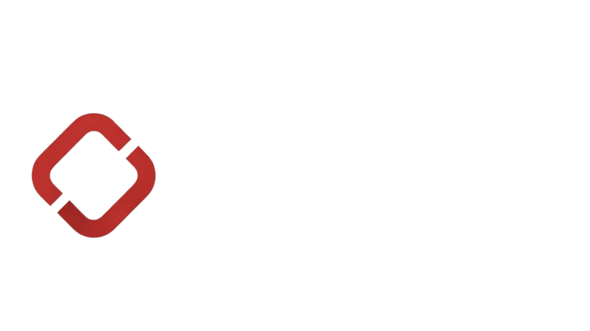
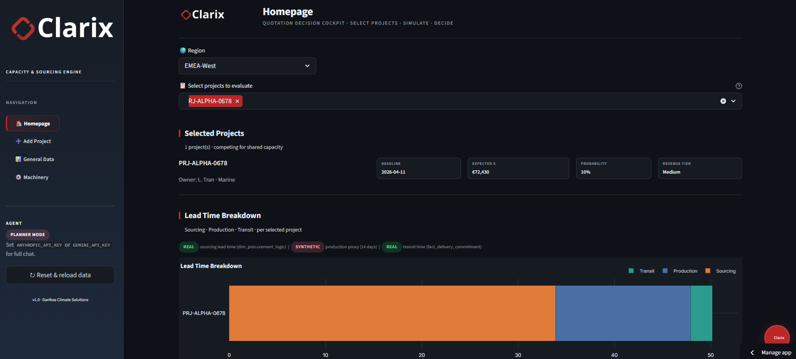
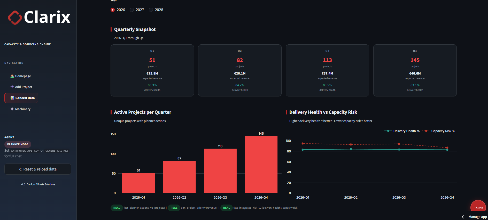
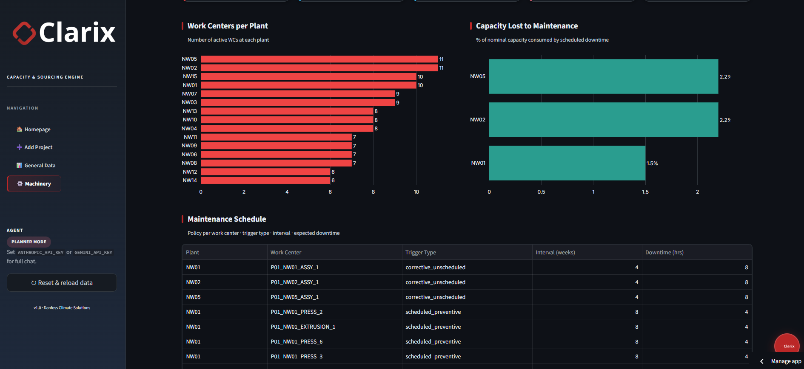

<div align="center">
  
  <p>Built in one day at the <strong>Danfoss Climate Solutions AI Hackathon</strong> (April 2026, Denmark)</p>
  <a href="https://clarix-danfoss.streamlit.app"></a>
</div>

---

### What is this?

Danfoss challenged teams to solve a real manufacturing planning problem: **how do you turn an uncertain sales pipeline into concrete factory and sourcing decisions before a shortage becomes expensive?** Clarix answers that by propagating probability-weighted demand through real production constraints, maintenance windows, tool cycle times, OEE, shift limits, and surfacing a ranked action list for planners.

---

## Screenshots

**Homepage — Quotation Decision Cockpit**


**General Data — Quarterly Snapshot & Delivery Health**


**Machinery — Work Centers & Maintenance Schedule**


---

## What it does

- **13-page Streamlit dashboard:** capacity planner, bottleneck detector, sourcing MRP, logistics disruptions, executive overview
- **4 scenarios:** base / optimistic / pessimistic / monte carlo
- **AI agent:** Claude `tool_use` answers natural-language planner questions backed by real engine data
- **Demo mode:** guided 7-step narrative with step banners

---

## 🧪 Live Demo

Get a feel of our solution at: https://clarix-danfoss.streamlit.app/

## Quick start

```bash
pip install -r requirements.txt
streamlit run app.py
```

Opens at **http://localhost:8501**.

> Optional: set `ANTHROPIC_API_KEY` in a `.env` file to enable the live AI agent.

---

## Stack

`Python 3.11` · `Streamlit` · `Pandas` · `Plotly` · `Claude claude-sonnet-4-6 (tool_use)`

---

## 👥 Team

| Name | GitHub |
|------|--------|
| Luigi | [Lucol24](https://github.com/Lucol24) |
| Carolina | [chaeyrie](https://github.com/chaeyrie) |
| Gabriele | [Gabbo693](https://github.com/Gabbo693) |
| Lara | [Lara-Ghi](https://github.com/Lara-Ghi) |
| Mats | [mqts241](https://github.com/mqts241) |
| Manish | — |
